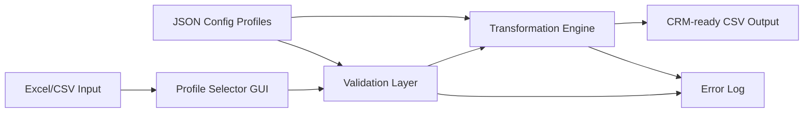

## Context

This project started as an internal reliability fix for CRM imports where source files were inconsistent and often contained sensitive customer data. The operational requirement was strict: no cloud upload and no external services. All processing had to stay local to reduce PII exposure and satisfy production controls.

The tool is built as a local ETL workflow in PowerShell. It takes Excel and CSV inputs, applies profile-driven transforms, validates data quality, and produces deterministic CRM-ready CSV outputs.

## Architecture

## Core Components

- **Lightweight GUI**
  - Local interface for selecting input files and choosing target CRM profiles.
  - Prevents manual script argument errors during operator handoff.
- **Validation Layer**
  - Detects required-field gaps, invalid formats, duplicates, and schema drift.
  - Writes row-level and field-level issues to structured logs for triage.
- **Transformation Engine**
  - Normalises headers and values, enforces naming conventions, and applies formatting rules.
  - Handles profile-specific mapping logic (e.g. Salesforce vs HubSpot style field sets).
- **Structured Logging**
  - Produces timestamped audit artifacts with run metadata, rejected rows, and transformation stats.
  - Supports repeatable troubleshooting and compliance review.

## Configuration Strategy

Rules are stored in JSON configuration profiles so transformation behavior can be changed without code edits. Each profile defines:

- input schema expectations
- source-to-target field mapping
- value normalisation and formatting rules
- required-field and validation constraints

This keeps logic portable across CRM targets and reduces operational friction for new onboarding pipelines.

## Data Reliability Approach

The pipeline is designed to fail safely:

- invalid records are isolated and logged, not silently dropped
- successful records still produce output where policy allows partial completion
- every run produces reproducible artifacts for audit and rollback analysis

## IC / SA Development Focus

This project is being used to build implementation and architecture capability in:

- data contract design between source systems and CRM targets
- operational risk controls for sensitive data handling
- profile-driven workflow design for multi-tenant integration patterns
- observability and auditability in internal tooling
