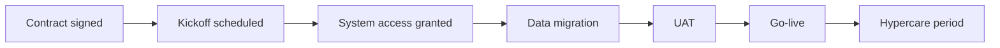

## The problem

Every implementation consultant I've spoken to has the same pain point: 
onboarding tracking lives in a spreadsheet, status updates get written 
manually, and blockers get buried in Slack threads.

This project is my attempt to build the tool I'd actually want to use 
in that role — and to document every decision along the way.

## What I'm building

A dashboard that:
- Tracks clients through defined onboarding stages
- Flags blockers with owner and age
- Generates a one-click client-ready status summary
- (Eventually) sends automated nudges when stages stall

## Phase 1 — where I'm starting

Static data, SQL queries, and a process diagram. No deployment yet. 
The goal this month is to understand the problem deeply before building anything.

## What I've learned so far

The process above looks simple. In practice, steps 3 and 4 are where 
every implementation I've researched falls over. Access provisioning 
takes longer than anyone budgets for. Data is never as clean as the 
client says it is.

That's what this tool needs to surface early.

## What's next

Phase 2: wire this into a Streamlit dashboard with fake client data. 
Goal is a live URL by end of May.

## What I'd do differently already

I started by thinking about the UI. I should have started by mapping 
the process — what actually happens in an onboarding — before touching 
any code. The diagram above came third. It should have come first.
